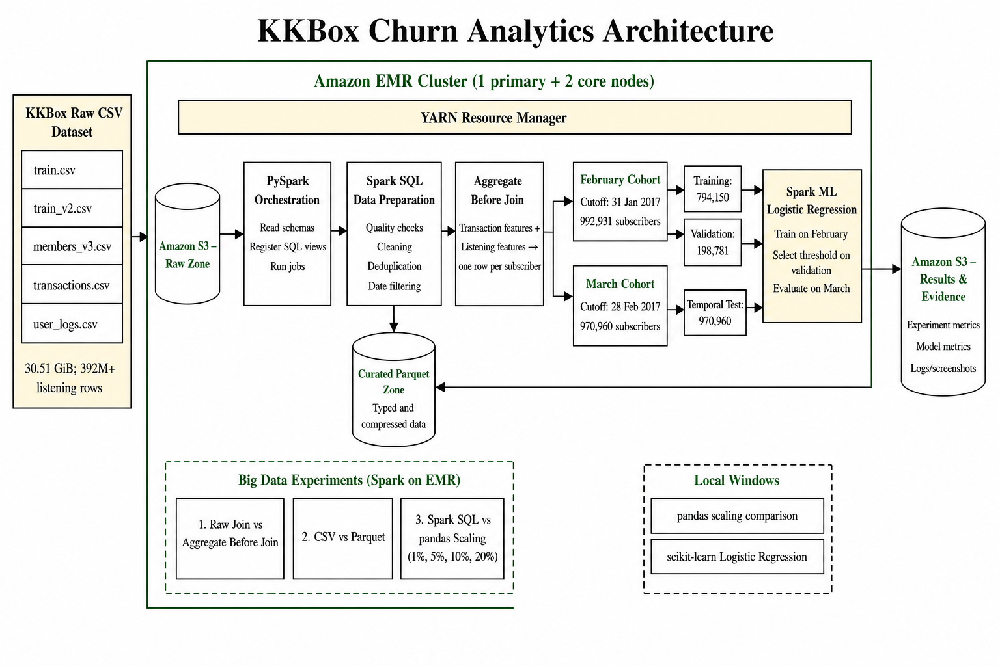

# KKBox Churn Analytics with Spark SQL on Amazon EMR

The project uses Amazon S3 for durable storage, Amazon EMR for distributed computing, PySpark for orchestration, Spark SQL for large-scale preparation and Spark ML for churn prediction. Matching pandas and scikit-learn programs provide the conventional single-computer comparisons required by the assignment.

## Research questions


1.How effectively can Spark SQL on Amazon EMR process and transform the large-scale KKBOX dataset into structured subscriber-level features? 

2.How do aggregate-before-join and Parquet storage affect the efficiency and reliability of processing the KKBOX dataset? 

3.How does Spark SQL on Amazon EMR compare with Python/pandas in terms of processing time, resource usage and scalability when handling increasing volumes of KKBOX data? 

4.What are the main advantages and limitations of using a Big Data approach compared with a traditional single-machine approach for large-scale KKBOX data analysis? 


## Dataset

The project uses the [WSDM KKBox Churn Prediction Challenge dataset](https://www.kaggle.com/competitions/kkbox-churn-prediction-challenge/data). The five required source files are `train.csv`, `train_v2.csv`, `members_v3.csv`, `transactions.csv` and `user_logs.csv`. Raw competition data is not committed because it is approximately 30.51 GiB and remains subject to Kaggle's access terms. Download it from Kaggle and place the five files under the S3 `raw/` prefix.

The submission templates, `transactions_v2.csv` and `user_logs_v2.csv` are not used. March event extensions would reveal activity from the period being predicted and could cause temporal leakage.

## Architecture and processing workflow

The five raw CSV files are uploaded to Amazon S3. An Amazon EMR cluster with one `m5.xlarge` primary node and two `m5.xlarge` core nodes runs the four PySpark jobs through YARN. Spark SQL checks and cleans the raw records, converts them to Parquet, aggregates transaction and listening behaviour separately, and then joins the subscriber-level results. February features use events through 31 January 2017 and March features use events through 28 February 2017. Spark ML trains on the February cohort and evaluates on the later March cohort. Summary results and evidence are written back to S3.



## Repository layout

```text
common/       Shared Spark configuration, schemas and helper functions
config/       Reproducible project parameters and feature definitions
jobs/         Four ordered PySpark/EMR jobs
sql/          Version-controlled Spark SQL cleaning and feature queries
local/        pandas scaling and scikit-learn comparison programs
docs/         EMR runbook, architecture and selected execution evidence
results/      Small audit, experiment and model summary files
```

## EMR execution

Upload the contents of `jobs/` and `common/kkbox_common.py` to an S3 code prefix. Upload the complete `sql/` folder below that same prefix. Replace `BUCKET`, `CODE_VERSION` and `RUN_ID` in the following example:

```bash
export BUCKET=your-bucket-name
export CODE_BASE=s3://$BUCKET/code/CODE_VERSION
export RAW_BASE=s3://$BUCKET/raw
export RUN_BASE=s3://$BUCKET/runs/RUN_ID

spark-submit --master yarn --deploy-mode client \
  --py-files "$CODE_BASE/kkbox_common.py" \
  "$CODE_BASE/01_build_curated_and_features.py" \
  --raw-base "$RAW_BASE" --run-base "$RUN_BASE" \
  --sql-base "$CODE_BASE" --shuffle-partitions 400

spark-submit --master yarn --deploy-mode client \
  --py-files "$CODE_BASE/kkbox_common.py" \
  "$CODE_BASE/02_run_big_data_experiments.py" \
  --raw-base "$RAW_BASE" --run-base "$RUN_BASE" \
  --shuffle-partitions 400

spark-submit --master yarn --deploy-mode client \
  --py-files "$CODE_BASE/kkbox_common.py" \
  "$CODE_BASE/03_train_spark_models.py" \
  --run-base "$RUN_BASE" --shuffle-partitions 400

spark-submit --master yarn --deploy-mode client \
  --py-files "$CODE_BASE/kkbox_common.py" \
  "$CODE_BASE/04_build_result_index.py" \
  --run-base "$RUN_BASE"
```

Each job prints labelled `[MILESTONE]` tables to the EMR step log. These tables expose row counts, treatments, validation checks, runtimes and model results rather than relying only on the EMR `COMPLETED` status. See [the detailed rerun guide](docs/AWS_RERUN_RUNBOOK.md) for step submission and log-inspection commands.

## Local comparisons

Create a Python environment and install the local dependencies:

```powershell
py -3.13 -m venv .venv
.\.venv\Scripts\Activate.ps1
python -m pip install --upgrade pip
python -m pip install -r requirements-local.txt
```

After downloading the Spark-generated `scaling_inputs/` and `local_ml_input/` folders from S3, run:

```powershell
python local\pandas_scaling_pipeline.py `
  --input-base downloaded-results\scaling_inputs `
  --percentages 1 5 10 20 `
  --output-dir local-results\scaling

python local\train_sklearn_models.py `
  --input-base downloaded-results\local_ml_input `
  --output-dir local-results\models `
  --seed 42
```

The comparisons use the same deterministic user samples, feature definitions, February split, March test cohort and Logistic Regression threshold. Row-level generated inputs and predictions are intentionally excluded from GitHub.


